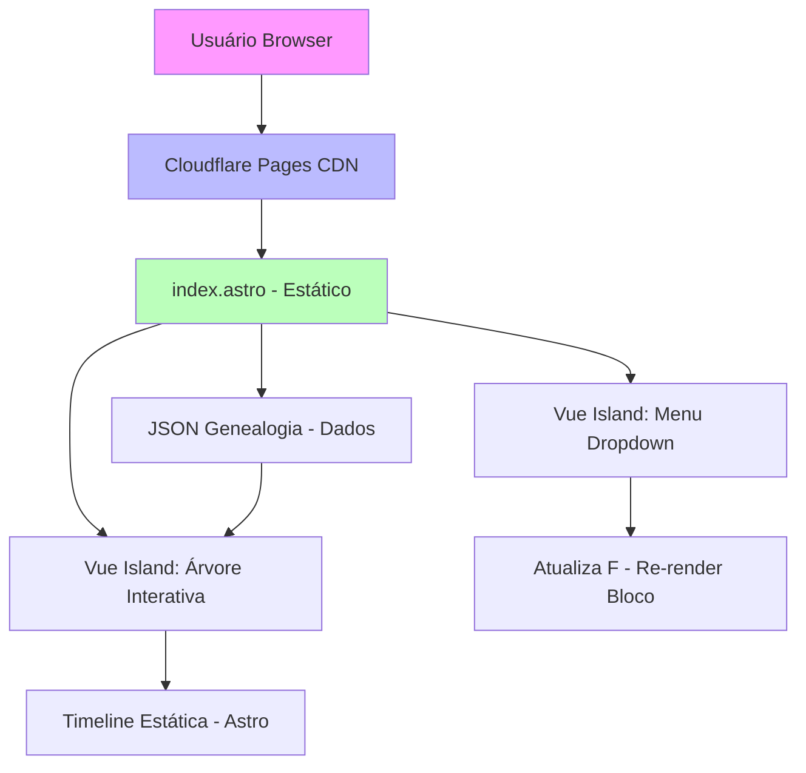

# System Patterns: Linhagem Bíblica - De Adão a Cristo

## Como as Peças se Encaixam

O sistema é uma app estática unidirecional: JSON → Astro pages → Vue islands para UI reativa. Fluxo: Usuário carrega index.astro (estático), que importa JSON e renderiza árvore base; Vue hidrata menu/expansões para interatividade. Sem estado global além de localStorage para prefs (ex.: idioma).

### Diagrama de Arquitetura (Mermaid - Cole em VS Code para visualizar)

